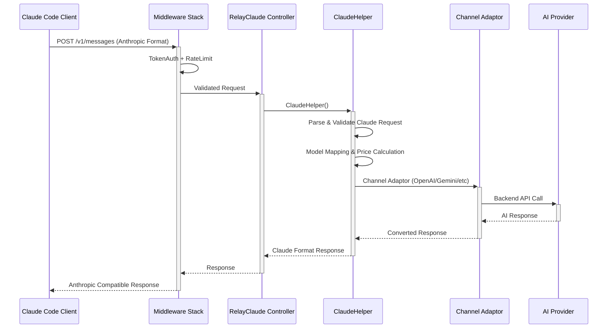

# 技术方案设计

## 1. 概述

基于对Claude Code Proxy工作原理的分析 <mcreference link="https://github.com/1rgs/claude-code-proxy" index="1">1</mcreference> <mcreference link="https://docs.anthropic.com/en/api/messages-examples" index="2">2</mcreference>，我们将在现有的new-api系统中添加对Anthropic Claude API格式的支持。Claude Code客户端使用标准的Anthropic API格式（/v1/messages端点） <mcreference link="https://docs.anthropic.com/en/api/overview" index="5">5</mcreference>，我们需要在现有系统基础上增加对这种格式的兼容性支持。

系统已经具备了Claude API的基础支持（通过现有的RelayClaude函数），我们将扩展这个功能，使其能够完全兼容Claude Code客户端的请求格式，同时复用现有的渠道管理、计费、限流等核心功能。

## 2. 架构设计

基于现有系统架构，我们将扩展现有的Claude处理能力，使其完全兼容Claude Code客户端。系统已经有/v1/messages路由和RelayClaude控制器，我们需要增强这些组件以支持Claude Code的特定需求。

## 3. 技术实现

### 3.1. 现有组件分析

系统已具备以下Claude相关组件：
-   **`controller/relay.go`**: 包含RelayClaude函数
-   **`relay/claude_handler.go`**: ClaudeHelper核心处理逻辑
-   **`relay/channel/claude/`**: Claude适配器实现
-   **`dto/claude.go`**: Claude API数据结构
-   **`router/relay-router.go`**: 已有/v1/messages路由

### 3.2. 需要增强的功能

1. **请求格式兼容性**: 确保完全支持Claude Code客户端的请求格式
2. **响应格式标准化**: 严格按照Anthropic API规范返回响应
3. **流式响应优化**: 优化SSE流式响应的兼容性
4. **错误处理**: 统一错误格式为Anthropic标准

### 3.3. 接口设计

现有路由已支持：
-   **Endpoint**: `POST /v1/messages`
-   **Content-Type**: `application/json`
-   **Headers**: 需要支持`anthropic-version`和`x-api-key`

### 3.4. 核心改进点

基于现有实现，需要重点改进以下方面：

1. **请求头处理**: 支持`anthropic-version`头部，确保版本兼容性
2. **响应格式**: 确保响应严格符合Anthropic API规范，包括：
   - 正确的响应结构（id, type, role, content等）
   - 流式响应的事件格式
   - 错误响应格式
3. **模型映射**: 利用现有的渠道系统，将Claude模型映射到后端AI服务
4. **工具调用**: 确保Tool Use功能的正确转换和处理

### 3.5. 实现策略

1. **增强现有ClaudeHelper**: 修改`relay/claude_handler.go`以完全兼容Claude Code
2. **优化响应转换**: 改进`relay/channel/claude/relay-claude.go`中的响应转换逻辑
3. **错误处理统一**: 确保所有错误都以Anthropic格式返回
4. **测试兼容性**: 添加Claude Code客户端兼容性测试

## 4. 测试策略

1. **兼容性测试**: 使用真实的Claude Code客户端测试API兼容性
2. **功能测试**: 验证所有Claude API功能（消息、流式、工具调用等）
3. **性能测试**: 确保Claude Code请求不影响系统整体性能
4. **回归测试**: 验证现有OpenAI API功能不受影响

## 5. 安全性

复用现有安全机制：

- **认证**: 使用现有的TokenAuth中间件
- **授权**: 复用现有的用户权限和配额系统
- **输入验证**: 严格验证Claude API请求格式
- **错误处理**: 避免敏感信息泄露

## 6. 实施计划

1. **阶段一**: 分析现有Claude实现，识别兼容性问题
2. **阶段二**: 增强ClaudeHelper和响应转换逻辑
3. **阶段三**: 添加Claude Code客户端兼容性测试
4. **阶段四**: 性能优化和错误处理完善
5. **阶段五**: 文档更新和部署